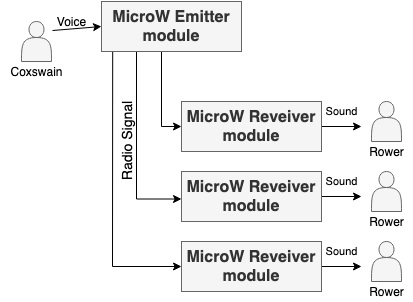
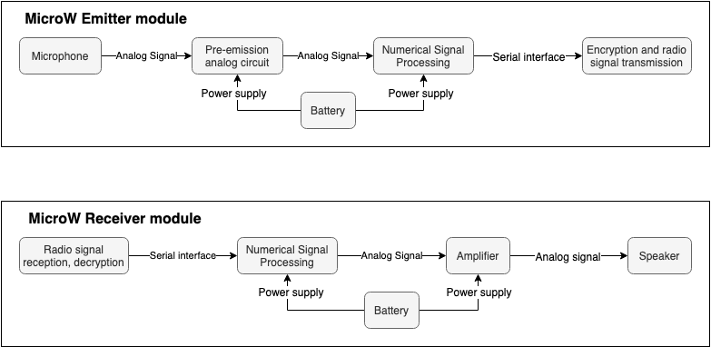

# MicroW

>  The Coxswain's voice is law.

MicroW is a *wireless* device that transmits the coxswain's voice in a rowing boat. The coxswain has a *wireless* microphone, and several *wireless* speakers are in the boat.

  

## Overview

MicroW consists of several waterproof devices placed inside a rowing boat. The coxswain has an emitter module, and one or several receiver modules are in the boat. Instead of wires, MicroW uses worldwide approved 2.4 GHz radio signal.

Coxswain's voice is processed by analog and numerical circuits and encrypted with 128-bit AES before radio transmission. Receiver modules shouldn't be more than 30 meters away from the emitter, which is enough compared to the lengh of a rowing boat (about 20 meters).

Here is an overview of the inside of each module :

Details about electrical circuits will be in [analog](analog) folder. Embedded C codes, radio transmission and everything digital related will be in [digital](digital) folder.

## Current project state

Currently, only a short documentation is available.
Embedded C codes for numerical processing and more documentation soon available

## License

The content of this project itself is licensed under the [Creative Commons Attribution 4.0 International license](https://creativecommons.org/licenses/by/4.0/), and the underlying source code used to format 
and display that content is licensed under the [3-Clause BSD License](https://opensource.org/licenses/BSD-3-Clause).

## Authors

* **Matthieu Planas**
* [**Alban Benmouffek**](https://github.com/sonibla)
