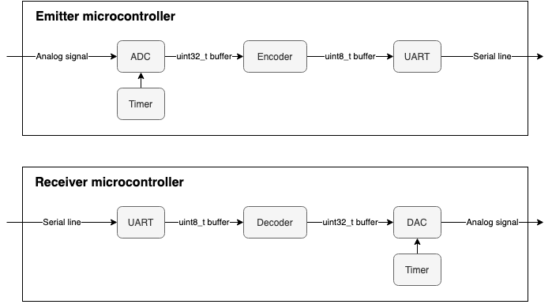

# MicroW - Digital components

Every module (receiver and emitter) is equipped with a microcontroller that basically acts as a serial/analog converter (we use [STM32F429ZI](https://www.st.com/en/microcontrollers-microprocessors/stm32f429zi.html) microcontrollers). Radio transmission and encryption is performed by [Digi Xbee® S1 802.15.4 RF Modules](https://www.digi.com/pdf/ds_xbeemultipointmodules.pdf). Those Xbee modules act as a serial line that can reach 250kb/s.

 This work is licensed under a <a rel="license" href="http://creativecommons.org/licenses/by/4.0/">Creative Commons Attribution 4.0 International License</a>.
